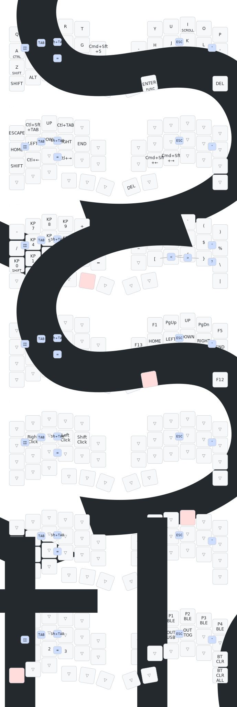

# zmk-config-roBa



> 先頭の SVG 図（keymap-drawer）は参考表示です。**キー割り当ての正は [`config/roBa.keymap`](config/roBa.keymap)** です。本文の ASCII 図と表を優先してください。

## オンボーディングガイド — roBa for Mac Vim ユーザー

> USキー配列 macOS + VSCode(Neovim) + Rails/Next.js/Terraform 向けの設定です。

---

### キーボード配列の全体像

```
左手                                                    右手
┌─────┬─────┬─────┬─────┬─────┐          ┌─────┬─────┬─────┬─────┬─────┐
│  Q  │  W  │  E  │  R  │  T  │          │  Y  │  U  │  I  │  O  │  P  │
├─────┼─────┼─────┼─────┼─────┤          ┌───┤─────┼─────┼─────┼─────┼─────┤
│  A  │  S  │  D  │  F  │  G  │🎛️encoder│ - ││  H  │  J  │  K  │  L  │Ct/' │
├─────┼─────┼─────┼─────┼─────┤          ├───┤─────┼─────┼─────┼─────┼─────┤
│  Z   │  X  │  C  │  V  │  B  │┌────┐│ ; ││  N  │  M  │  ,  │  .  │  /  │
├─────┼─────┼─────┼─────┼─────┤│ :  │├───┤─────┼─────┤     │     ├─────┤
│Shift│ Alt │ Cmd │英数 │Space│├────┤│ BS││Enter│     │     │     │ Del │
│     │     │     │ /BT │/NUM ││かな││   ││/FUNC│     │     │     │     │
└─────┴─────┴─────┴─────┴─────┘│/NAV│└───┘─────┴─────┘     │     └─────┘
                                └────┘
小指側 ──────────────────→ 中央（割れ目）
[Shift] [Alt] [Cmd] [英数] [Space] [かな]  ← 左手の親指キー

🎛️ ロータリーエンコーダ（G の右隣のホイール）
   回す → スクロール ／ 押し込む → 📸 スクリーンショット
🔴 トラックボール（右手側）
```

---

### 🚀 まず覚える 7 つの操作

roBa を手に取ったら、まずこの 7 つだけ覚えてください。

#### 1. ESC（Vim モード切替）
```
J + K を同時押し → ESC
```
Vim の Insert → Normal の復帰はこれだけ。右手ホームポジションなので自然に押せます。
※ 高速タイピング中は誤爆しないよう 280ms のアイドルガードが入っています。

#### 2. スペースと Enter
```
左親指の Space キーの位置 → Space（タップ）
右親指の Enter キーの位置 → Enter（タップ）
```
最もよく使う 2 キーが最も押しやすい位置にあります。

#### 3. Backspace と Delete
```
「BS」キー（Enter の隣） → Backspace
右端キー          → Delete
```
Backspace は mod-tap なしなので、長押しで連続削除できます。

#### 4. 日本語 ↔ 英語 の切り替え
```
「英数」キー（Space の左隣）をタップ → 英数入力に切替
「かな」キー（Space の右隣、割れ目の直前）をタップ → かな入力に切替
A + S 同時押し → 英数入力に切替（コンボ）
```
どのレイヤーにいても、これらをタップすれば Default レイヤーに戻りつつ IME が切り替わります。

#### 5. Tab（コード補完・インデント）
```
S + D を同時押し → Tab
D + F を同時押し → Shift+Tab（逆インデント）
```
VSCode の Copilot 提案を受け入れるのも S+D です。

#### 6. ロータリーエンコーダ（G の右隣のホイール）

エンコーダは **3 つの操作** ができます：

| 操作 | やり方 | 動作 |
|------|--------|------|
| **回す** | ホイールを指で転がす | スクロール（レイヤーで変化） |
| **押し込む** | ホイールをカチッと内側に押す | 📸 スクリーンショット (Cmd+Shift+4) |
| **Enter + 押し込む** | Enter を押しながらホイールを押し込む | 🎥 画面収録ツール (Cmd+Shift+5) |

**スクリーンショットを撮るには**: エンコーダを**ボタンのようにカチッと押し込む**と、十字カーソルが出て範囲選択で撮影できます。
**画面収録をするには**: Enter を押しながらエンコーダを押し込むと、macOS の Screenshot toolbar が開き、画面全体または選択範囲の録画を開始できます。

**エンコーダ回転の動作（レイヤー別）**:
| レイヤー | 回転の動作 |
|----------|-----------|
| Default（通常） | マウススクロール（上下） |
| NAV（「かな」キー ホールド） | ブラウザ/VSCode タブ切替 |
| FUNC（Enter ホールド） | ズーム（Cmd+= / Cmd+-） |

#### 7. VSCode / Cursor のコードジャンプ
```
トラックボールで関数名にポインタを合わせる
F + G を同時押し → 定義元へジャンプ
```
roBa が内部的に `Cmd+左クリック` を送るため、左下の Cmd キーを押す必要はありません。

---

### 🎯 ホームロウモディファイア

通常のキーボードと違い、ホームロウ（指のホームポジション）にモディファイアが仕込まれています。

| キー | タップ | 長押し（200ms） | 主な用途 |
|------|--------|----------------|----------|
| ' の位置 | `'` | `Ctrl` | `Ctrl+C/V/X/Z/A/P/L` など**全キー**との組合せ |

> A キーは頻度が高いため、誤Ctrl発動を防ぐ目的で **純粋な `a` キー**としています。
> Ctrl は **' 長押し**のみ。右手小指ホームポジションなので自然に押せます。

| ショートカット | 操作 |
|---------------|------|
| Ctrl+C（ターミナル停止など） | **' 長押し + C** |
| Ctrl+V（ターミナルペースト） | **' 長押し + V** |
| Ctrl+Z（取消・サスペンド） | **' 長押し + Z** |
| Ctrl+A（行頭・Emacs 系） | **' 長押し + A** |
| Ctrl+P / N（履歴） | **' 長押し + P / N** |
| Ctrl+L（クリア） | **' 長押し + L** |

Shift は **左下段の Shift キー**（左小指の最下段）を使います。

#### キーリピート
', Space, Enter は長押しするとモディファイア/レイヤーが発動するため、**通常の長押しではキーリピートしません**。
代わりに **ダブルタップ＋ホールド**（素早く2回押して2回目を押し続ける）でリピートできます。

| キー | 長押し | ダブルタップ+ホールド |
|------|--------|---------------------|
| A | そのままリピート ✅ | — |
| ' | Ctrl | `'''...`（リピート） |
| Space | NUM レイヤー | スペース連打 |
| Enter | FUNC レイヤー | Enter 連打 |
| Backspace | そのままリピート ✅ | — |

※ その他のアルファベットキーは通常通り長押しでリピートします。

#### macOS（US）での Cmd と Ctrl

ZMK の keymap では `LG` が **Cmd**、`LC` が **Ctrl** として macOS に送られます。

- **ターミナル・Vim・Emacs 系**: **' 長押し + 文字** で Ctrl 系（例: Ctrl+C で停止、Ctrl+A で行頭）
- **GUI のコピー・保存など**: 左手親指下段の **Cmd キー** を使う（例: Cmd+C、Cmd+S）。' 長押しは Cmd にはなりません
- **NAV / FUNC のショートカット**: 表記の ⌘ は Cmd、Ct は Ctrl に対応（[`config/roBa.keymap`](config/roBa.keymap) の `LG(...)` / `LC(...)`）

---

### 📂 レイヤー構成と切替方法

```
                    ┌──────────────┐
                    │  Layer 0     │ ← 常にここが基本
                    │  Default     │
                    └──┬───┬───┬──┘
           ┌──────────┘   │   └──────────┐
     「かな」hold      「Space」hold    「Enter」hold
     ┌─────┴─────┐ ┌─────┴─────┐ ┌─────┴─────┐
     │  Layer 1  │ │  Layer 2  │ │  Layer 3  │
     │  NAV      │ │  NUM      │ │  FUNC     │
     └───────────┘ └───────────┘ └───────────┘

     V+B トグル       トラックボール動かす   「英数」hold
     ┌─────┴─────┐ ┌─────┴─────┐ ┌─────┴─────┐
     │  Layer 5  │ │  Layer 4  │ │  Layer 6  │
     │  SCROLL   │ │  MOUSE    │ │  BT       │
     └───────────┘ └───────────┘ └───────────┘
```

| レイヤー | 切替方法 | 用途 |
|----------|----------|------|
| **NAV** (1) | 「かな」（Spaceの右隣）を **押しっぱなし** | 矢印キー、HOME/END、タブ切替 |
| **NUM** (2) | 「Space」を **押しっぱなし** or **ロック** | 数字入力、プログラミング記号 |
| **FUNC** (3) | 「Enter」を **押しっぱなし** | F キー、ページ移動 |
| **MOUSE** (4) | トラックボールを動かすと **自動遷移** | マウスクリック |
| **SCROLL** (5) | Default/MOUSE/SCROLL 中に **V+B** 同時押し（トグル） | トラックボールがスクロールに変化 |
| **BT** (6) | 「英数」（Spaceの左隣）を **押しっぱなし** | Bluetooth 接続管理 |

**重要**: NAV / NUM / FUNC / BT のレイヤーキーは **押している間だけ** 有効です（NUM ロック・MOUSE/SCROLL トグルは例外）。指を離すと Default に戻ります。

---

### ⌨️ Layer 1: NAV（ナビゲーション）

**切替**: 「かな」キー（Space の右隣、割れ目の直前）を押しっぱなし

```
左手で矢印操作、右手はトラックボールに添えたまま
┌─────┬──────┬─────┬──────┬──────┐
│ ESC │Ct⇧Tab│  ↑  │CtTab │ ⌘`  │
├─────┼──────┼─────┼──────┼──────┤
│HOME │  ←   │  ↓  │  →   │ END  │
├─────┼──────┼─────┼──────┼──────┤
│Shift│Ct←  │Ct↓  │ Ct→  │ Ct↑  │
└─────┴──────┴─────┴──────┴──────┘
🎛️ エンコーダ = Ctrl+PgUp/PgDn（タブ切替）
```

**よく使う操作**:
| やりたいこと | 操作 |
|-------------|------|
| カーソル移動 | NAV + E/S/D/F（↑←↓→） |
| 行頭/行末へ | NAV + A/G（HOME/END） |
| ブラウザのタブ切替 | NAV + W/R（Ctrl+Shift+Tab / Ctrl+Tab） |
| VSCode のタブ切替 | NAV + エンコーダ回転 |
| **VSCode / Cursor の戻る** | **NAV + H（Ctrl+-）** |
| **VSCode / Cursor の進む** | **NAV + L（Ctrl+Shift+-）** |
| macOS ウィンドウ切替 | NAV + T（Cmd+`） |
| macOS デスクトップ切替 | NAV + X/V（Ctrl+←/→） |
| Mission Control（全ウィンドウ表示） | NAV + B（Ctrl+↑） |
| アプリ Exposé（現アプリのウィンドウ一覧） | NAV + C（Ctrl+↓） |
| テキスト選択しながら移動 | NAV + Z（Shift）を押しながら S/F/E/D/A/G |
| 単語単位で選択 | NAV + Z + X/V（Option+Shift+←/→） |

※ VSCode / Cursor の Vim / Neovim 拡張では、Normal mode ではなく Insert mode や入力欄で使うと通常のテキスト選択として動きます。

---

### 🔢 Layer 2: NUM（数字・記号）

**切替**: 「Space」キーを押しっぱなし or **ロック**

```
左手 = テンキー                右手 = プログラミング記号
┌─────┬─────┬─────┬─────┬─────┐ ┌─────┬─────┬─────┬─────┬─────┐
│  -  │  7  │  8  │  9  │  +  │ │  ^  │  &  │  `  │  (  │  )  │
├─────┼─────┼─────┼─────┼─────┤ ├─────┼─────┼─────┼─────┼─────┤
│  /  │  4  │  5  │  6  │  *  │ │  !  │  @  │  #  │  $  │  %  │
├─────┼─────┼─────┼─────┼─────┤ ├─────┼─────┼─────┼─────┼─────┤
│Sf/0 │  1  │  2  │  3  │  .  │ │  [  │  ]  │  {  │  }  │  \  │
├─────┼─────┼─────┼─────┤     │ └─────┴─────┴─────┴─────┴─────┘
│     │     │     │ 🔒  │ 🔒  │  右端: |（パイプ）
└─────┴─────┴─────┴─────┴─────┘
                    ↑ 英数/Space の位置 = NUM ロック/解除
```

#### NUM レイヤーのロック機能 🔒
長い数字を入力するとき、Space を押しっぱなしにするのは大変です。
ロック機能を使えば **指を離しても NUM レイヤーに留まれます**。

| やりたいこと | 操作 |
|-------------|------|
| 1〜2桁の数字 | Space **押しっぱなし** + 数字キー（従来通り） |
| 長い数字の入力 | ① Space 押しっぱなし → ② **英数キー位置**をタップ（🔒ロック）→ ③ Space を離す → ④ 自由に数字入力 → ⑤ **英数キー位置 or Space 位置**をタップ（🔓解除） |

**コーディングで頻出する記号の打ち方**:

| 記号 | 操作 | 使用場面 |
|------|------|----------|
| `()` | Space 押しながら O / P | 関数呼び出し、メソッド定義 |
| `[]` | Space 押しながら N / M | 配列、Terraform のリスト |
| `{}` | Space 押しながら , / . | Ruby ブロック、JS オブジェクト、Terraform |
| `\|` | Space 押しながら 右端 | Ruby ブロック引数 `\|x\|`、シェルパイプ |
| `` ` `` | Space 押しながら I | JS テンプレートリテラル、マークダウン |
| `~` | Space 押しながら I + Shift | ホームディレクトリ `~/`（NUM 中 I は `` ` ``、Shift で `~`） |
| `_` | Space 押しながら 右内側 `-` の位置 | スネークケース（Ruby） |
| `=` | C + V 同時押し（コンボ） | 代入、比較（どのレイヤーでも使用可能） |
| `"` | L + ' 同時押し（コンボ） | 文字列リテラル |

#### 括弧ペアリング（自動ペア入力）🆕

NUM レイヤー内で **開き括弧と閉じ括弧を同時押し** すると、ペアで入力されてカーソルが中に移動します。

| 同時押し | 出力 | 使用場面 |
|----------|------|----------|
| `(` + `)` （O + P 位置） | `()` + カーソル中央 | メソッド定義、関数呼び出し |
| `[` + `]` （N + M 位置） | `[]` + カーソル中央 | 配列リテラル、添字アクセス |
| `{` + `}` （, + . 位置） | `{}` + カーソル中央 | ハッシュ、ブロック、オブジェクト |

> 💡 個別に `(` や `)` だけ打ちたい場合は、従来通り片方だけ押してください。
> ⚠️ VSCode のエディタ自動ペアリングが ON の場合は二重にペアされるため、エディタ側の設定（`"editor.autoClosingBrackets": "never"`）を OFF にするか、ターミナル/REPL での利用がおすすめです。

---

### 🔧 Layer 3: FUNC（ファンクション）

**切替**: 「Enter」キーを押しっぱなし

```
左手 = Cmd+数字                  右手 = F キー + ページナビ
┌─────┬─────┬─────┬─────┬─────┐ ┌─────┬─────┬─────┬─────┬─────┐
│⌘ 1  │⌘ 2  │⌘ 3  │⌘ 4  │⌘ 5  │ │ F1  │PgUp │  ↑  │PgDn │ ⌘R  │
├─────┼─────┼─────┼─────┼─────┤ ├─────┼─────┼─────┼─────┼─────┤
│⌘ 6  │⌘ 7  │⌘ 8  │⌘F  │⌘⇧F │ │HOME │  ←  │  ↓  │  →  │ END │
├─────┼─────┼─────┼─────┼─────┤ ├─────┼─────┼─────┼─────┼─────┤
│Mute │Vol- │Vol+ │Bri- │Bri+ │ │     │     │     │     │ F11 │
└─────┴─────┴─────┴─────┴─────┘ └─────┴─────┴─────┴─────┴─────┘
🎛️押し込み: ⌘⇧5 / 右端: ⌘⌥I
```

| やりたいこと | 操作 |
|-------------|------|
| ミュート / 音量 / 輝度 | Enter 押しながら Z/X/C/V/B（Mute, Vol±, Bright±） |
| **ブラウザのタブ番号指定** | **Enter 押しながら Q〜T（⌘1〜⌘5）** |
| **現在ページ / 現在ファイルを検索** | **Enter 押しながら F（⌘F）** |
| **ワークスペース全体を検索** | **Enter 押しながら G（⌘⇧F）** |
| **画面収録ツールを開く** | **Enter 押しながらエンコーダ押し込み（⌘⇧5）** |
| **ブラウザの更新** | **Enter 押しながら P 位置（⌘R）** |
| **検証ツール（DevTools）** | **Enter 押しながら 右端の Del 位置（⌘⌥I）** |
| tmux / cmux のペイン切替 | Enter 押しながら Q〜T（⌘1〜⌘5）※要・側の設定 |
| フルスクリーン切替 | Enter 押しながら / 位置（F11） |
| 長いファイルのページ送り | Enter 押しながら U/O（PgUp/PgDn） |
| **🔍 画面の拡大/縮小** | **Enter 押しながらエンコーダ回転（Cmd+= / Cmd+-）** |

---

### 🖱️ トラックボール & マウス操作

#### カーソル移動
トラックボールを動かすだけ。自動で MOUSE レイヤー（Layer 4）に切り替わります。
トラックボール停止後は約 1200ms、クリック入力後は約 600ms MOUSE レイヤーを維持するため、連続クリックやダブルクリックが文字入力に戻りにくくなっています。

#### クリック（MOUSE レイヤー中）

右手でトラックボール操作中は、**左手でクリック**するのがコツです。

| 操作 | 左手（推奨） | 右手 |
|------|-------------|------|
| 左クリック | F | J |
| 中クリック（新タブで開く） | D | K |
| 右クリック | S | L |
| コードジャンプ | F + G | - |

> 💡 右手はトラックボールに乗せたまま、左手の S/D/F でクリックするとスムーズです。

#### VSCode / Cursor のコードジャンプ

関数名や変数名の定義元へ移動したいときは、右クリックメニューではなく **F + G** を使います。

```
① トラックボールでシンボルにポインタを合わせる
② F + G を同時押しする
③ Cmd+左クリックとして送信され、定義元へジャンプ
```

左下の Cmd キーを押す操作ではありません。`F + G` を押すと、roBa が内部的に `Cmd+左クリック` を送ります。
Default/MOUSE のどちらでも発動するコンボのため、MOUSE レイヤーが切れた瞬間に `g` が入力される事故を避けられます。
`F + G` は約 100ms 以内の同時押しとして判定します。通常タイピング中の誤発動を避けるため、直前に文字キー入力がある場合は発動しません。
S で手動右クリックしてメニューを選ぶ必要がないため、S の誤入力やメニュー選択の手間も減ります。
F のダブルクリックで単語選択したい場合も、MOUSE レイヤー維持時間を長めにしているため、`f` が入力される誤操作が起きにくくなります。

#### テキスト選択（Shift+クリック）🆕

ドラッグでテキストを選択するのが難しい場合、**Shift+クリック**が便利です。

```
① トラックボールでカーソルを選択開始位置へ
② 左手 F で左クリック（選択の起点を置く）
③ トラックボールでカーソルを選択終了位置へ
④ 左手 Shift を押しながら F で左クリック（範囲選択完了）
⑤ Cmd+C でコピー
```

**ダブルクリックで単語選択 → Shift+クリックで拡張** も有効です：
```
① 左手 F を素早く2回タップ（ダブルクリック → 単語選択）
② トラックボールで選択を広げたい位置へ
③ Shift + F で左クリック（選択範囲を拡張）
```

#### MOUSE レイヤーのロック（ドラッグ操作）🆕

ファイルの移動やウィンドウのリサイズなど、**ドラッグ操作**が必要な場合：

```
① トラックボールを動かす → MOUSE レイヤー自動ON
② 英数キー or Space 位置をタップ → 🔒 MOUSE ロック
  （トラックボールを止めても MOUSE レイヤーが維持される）
③ 左手 F をホールド（MB1 押しっぱなし） + 右手トラックボール = ドラッグ
④ F を離す → ドラッグ終了
⑤ 英数キー or Space 位置をタップ → 🔓 ロック解除
```

#### スクロール
- **ロータリーエンコーダ**を回す → 上下スクロール（macOS ナチュラルスクロール対応）
- **SCROLL レイヤー（Layer 5）**が ON のとき、トラックボールでスクロール（横スクロールも可能）
  - ON/OFF: Default/MOUSE/SCROLL 中に **V+B** 同時押し
  - SCROLL 中にも **V+B** で Default に戻せます
- **NAV + J / K** → Page Up / Page Down（ターミナルやエディタのスクロールに最適）

> 💡 エンコーダを**押し込む**とスクリーンショット（Cmd+Shift+4）が起動します。回す・押し込むの 2 操作を覚えておきましょう。

---

### 🎙️ Claude 音声入力（Mac）

roBa のレイヤー構成（Space 長押し = NUM、`:` / Alt はそのまま）を維持しつつ、Claude 公式の音声入力と両立する設定です。

#### Claude Code（ターミナル）

Space 長押しは NUM レイヤーに割り当て済みのため、Claude Code 側は **tap モード**（Space キー binding はデフォルトのまま）を使います。

**設定**（[`~/.claude/settings.json`](https://code.claude.com/docs/en/voice-dictation)）:

```json
{
  "voice": {
    "enabled": true,
    "mode": "tap"
  }
}
```

またはターミナルで `/voice tap` を実行（設定はセッションをまたいで保持されます）。

| 操作 | やり方 |
|------|--------|
| 録音開始 | プロンプトが**空**のとき、Space を**短くタップ** |
| 録音停止 | もう一度 Space を**短くタップ** |
| 通常のスペース | プロンプトに文字があるときの Space タップ（[公式](https://code.claude.com/docs/en/voice-dictation#tap-to-record-and-send)） |

**注意**:
- Space **長押しは NUM レイヤー**です。Claude Code 中の音声入力に Space 長押しは使いません。
- 「入力が空か」の判定は **Claude Code アプリ内**で行われます（roBa / macOS ではありません）。
- ターミナルに**マイク**権限が必要です。Claude.ai アカウントでのログインが必要です（[要件](https://code.claude.com/docs/en/voice-dictation#requirements)）。

#### Claude Desktop（Quick Entry 音声）

カスタム文字列ショートカットとの衝突を避けるため、Desktop 側は **Voice shortcut = Caps Lock**（デフォルト）のまま、roBa から **Caps Lock キーイベント**を送ります。

**Desktop 側の設定**（[公式ヘルプ](https://support.claude.com/en/articles/12626668-use-quick-entry-with-claude-desktop-on-mac)）:

1. Claude Desktop → **Settings → General → Desktop app**
2. **Voice shortcut** → **Caps Lock を有効**
3. macOS **14+**、**Speech Recognition** 権限を許可

**roBa の操作**:

| 操作 | やり方 |
|------|--------|
| 音声開始 | **Shift + Del** 同時押し（Caps Lock 相当） |
| 音声停止 | もう一度 **Shift + Del** 同時押し |

- 誤爆防止のため **280ms アイドルガード**付き（タイピング直後は発動しません）。
- Quick Entry 用の音声です。メインチャットウィンドウのマイクボタンとは別経路です。

#### Codex Appshot（⌘+⌘ 相当）

roBa には **Right Command キーがない**ため、Codex の Hotkey「⌘ + ⌘」はそのままでは押せません。

**Codex 側**: Settings → Appshots → Hotkey = **⌘ + ⌘**

**roBa 側**: **G + H** 同時押し → 左右 Command を同時送信（280ms idle）

---

### 🔗 Bluetooth 接続管理（Layer 6）

**切替**: 「英数」キーを押しっぱなし

| 操作 | キー |
|------|------|
| プロファイル 0〜4 切替 | Y / U / I / O / P |
| 現在のプロファイルをクリア | / の位置（BT CLR） |
| 全プロファイルをクリア | 右端（BT CLR ALL） |
| ファームウェア書き込みモード | ; の位置（bootloader） |

---

### 🗺️ コンボ一覧（同時押し）

コンボはどのレイヤーでも使えます（一部除く）。

| 同時押し | 出力 | 覚え方 |
|----------|------|--------|
| **J + K** | `ESC` | Vim の jk マッピングと同じ感覚 |
| **S + D** | `Tab` | 左手ホームロウで自然に押せる |
| **D + F** | `Shift+Tab` | Tab の隣 = 逆 Tab |
| **A + S** | `英数` + Layer 0 復帰 | **A**lphanumeric の A |
| **L + '** | `"` (ダブルクォート) | ' の隣 = " |
| **C + V** | `=` (イコール) | **C**ode の = |
| **F + J** | Caps Word | 定数・SQL キーワードなど連続大文字（スペース等で解除） |
| **Shift + Del** | Caps Lock | Claude Desktop Quick Entry 音声（280ms idle） |
| **G + H** | ⌘ + ⌘（左右同時） | Codex Appshot（Hotkey = ⌘+⌘ 設定時、280ms idle） |
| **V + B** | SCROLL レイヤー ON/OFF | Default/MOUSE/SCROLL 中のみ |
| **( + )** | `()` + カーソル中央 | NUM レイヤー限定。ペアリング |
| **[ + ]** | `[]` + カーソル中央 | NUM レイヤー限定。ペアリング |
| **{ + }** | `{}` + カーソル中央 | NUM レイヤー限定。ペアリング |

---

### 📋 日常の作業フロー別チートシート

#### Rails 開発（Ruby）
```
def method(arg)    → d e f Space Enter(かっこは Space+O/P)
  hash[:key]       → : はデフォルトレイヤー左内側、[] は Space+N/M
  block { |x| }    → {} は Space+,/. 、| は Space+右端
  "string #{var}"  → " は L+' コンボ、{} は Space+,/.
end
```

#### Next.js 開発（JSX/TypeScript）
```
<Component />      → <> は Shift+,/.（デフォルト）
const x = () => {} → = は C+V コンボ、() は Space+O/P、{} は Space+,/.
`template ${}`     → ` は Space+I、${} は Shift+4 と Space+,/.
```

#### Terraform
```
resource "type" "name" {  → " は L+' コンボ、{ は Space+,
  key = "value"           → = は C+V コンボ
}
```

#### ターミナル操作
```
Ctrl+C (停止)       → ' 長押し + C
Ctrl+V (ペースト)   → ' 長押し + V
Ctrl+A (行頭移動)   → ' 長押し + A
Ctrl+Z (サスペンド)  → ' 長押し + Z
Ctrl+E (行末移動)   → ' 長押し + E
Ctrl+L (クリア)      → ' 長押し + L
Ctrl+R (履歴検索)    → ' 長押し + R
Ctrl+P (前の履歴)    → ' 長押し + P
Ctrl+N (次の履歴)    → ' 長押し + N
cd ~/path            → ~ は NUM 中 I + Shift
ls | grep            → | は Space+右端
```

#### Vim 操作（VSCode Neovim）
```
Normal モードへ     → J+K 同時押し（ESC）
:w (保存)          → Cmd+S が楽（Cmd は左親指下段）
:q (閉じる)        → Cmd+W が楽
ビジュアルモード選択 → NAV レイヤーで Shift+矢印
```

---

### 💡 慣れるためのステップ

#### Week 1: 基本操作
- [ ] アルファベットと Space/Enter/Backspace でタイピング練習
- [ ] J+K で ESC が出ることを確認
- [ ] 英数/かな切替を左親指で練習

#### Week 2: レイヤー操作
- [ ] NUM レイヤー（Space 長押し）で数字を打つ練習
- [ ] NAV レイヤー（かなキー長押し）で矢印を使う練習
- [ ] S+D で Tab、C+V で =、F+J で Caps Word のコンボを意識して使う

#### Week 3: 記号とコーディング
- [ ] NUM レイヤーでの括弧類 `()[]{}` を練習
- [ ] バッククォート、パイプ、バックスラッシュを打てるようにする
- [ ] FUNC レイヤーで ⌘R（更新）、⌘⌥I（DevTools）、音量・輝度（Z〜B）を使ってみる

#### Week 4: 応用
- [ ] トラックボール + クリック（J/K/L）でマウス操作
- [ ] エンコーダでスクロール
- [ ] NAV レイヤーのショートカット（タブ切替、デスクトップ切替）を活用
- [ ] Claude Code: Space タップで音声入力、Desktop: Shift+Del で Quick Entry 音声

---

### ⚙️ カスタマイズしたくなったら

- **ZMK Studio** でリアルタイム編集: roBa を USB 接続し、[ZMK Studio](https://zmk.studio/) にアクセス
- **キーマップファイル直接編集**: `config/roBa.keymap` を編集して `git push` → GitHub Actions が自動ビルド
- **参考リンク**:
  - [ZMK 公式ドキュメント](https://zmk.dev/docs)
  - [roBa ハードウェアリポジトリ](https://github.com/kumamuk-git/roBa)
  - [momocus さんのキーマップ記事](https://zenn.dev/momocus/articles/d8a98e93679798)
  - [ZMK オートマウスレイヤーを極める](https://zenn.dev/kot149/articles/zmk-auto-mouse-layer)
